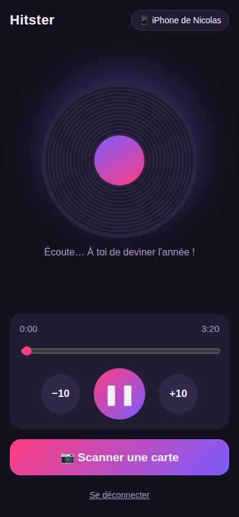

# 🎵 Hitster maison

Version personnelle du jeu [Hitster](https://hitstergame.com) : on scanne une carte, la chanson démarre sur Spotify **sans afficher le titre ni l'artiste**, et il faut deviner l'année.

**👉 Application : https://nicolasleloux.github.io/hitster/**

## Fonctionnalités

- Connexion à Spotify (compte Premium)
- Scan du QR code d'une carte avec la caméra du téléphone
- Lecture sans aucune information sur le morceau
- Lecture / pause, −10 s / +10 s, barre de progression avec le temps
- Bouton « Scanner une carte » pour passer à la suivante
- Choix de l'appareil de lecture (téléphone, enceinte, ordinateur…)
- Le morceau est mis en répétition pour que Spotify n'enchaîne pas sur une autre chanson

## Installation sur le téléphone

Pas d'App Store, pas de mode développeur : c'est une web app qu'on ajoute à l'écran d'accueil.

- **iPhone** : ouvrir le lien dans **Safari** → *Partager* → *Sur l'écran d'accueil*
- **Android** : ouvrir le lien dans **Chrome** → *⋮* → *Installer l'application*

## Utilisation

1. Ouvrir l'app **Spotify** une fois (pour qu'elle soit visible comme appareil de lecture).
2. Lancer **Hitster** et se connecter à Spotify.
3. *Scanner une carte* : la musique démarre.
4. Le bouton en haut à droite permet de changer d'appareil.

> ⚠️ Le titre reste visible sur l'écran de verrouillage et dans la notification Spotify : ne pas regarder 😉

## Comment ça marche

Spotify ne permet pas de jouer de la musique directement dans un navigateur mobile. L'app pilote donc l'**app Spotify du téléphone** via l'API Web Spotify (Spotify Connect). Il faut donc :

- un compte **Spotify Premium** ;
- l'app Spotify installée sur le téléphone.

La connexion utilise OAuth PKCE : pas de serveur, rien n'est stocké ailleurs que sur le téléphone.

### Format des cartes

Chaque QR code contient l'**ID Spotify du morceau** (22 caractères, ex. `4uLU6hMCjMI75M1A2tKUQC`). Un appareil photo classique n'en fait rien, donc il ne révèle pas la chanson.
Sont aussi acceptés : `spotify:track:<ID>` et `https://open.spotify.com/track/<ID>` (déconseillé, l'appareil photo l'ouvrirait).

## Configuration (déjà faite)

1. **App Spotify** sur [developer.spotify.com/dashboard](https://developer.spotify.com/dashboard) :
   - Redirect URI : `https://nicolasleloux.github.io/hitster/` (avec le `/` final)
   - API : *Web API*
   - *User Management* : ajouter l'e-mail Spotify de chaque joueur qui se connecte (mode développement)
2. **Client ID** dans [`config.js`](config.js).
3. **GitHub Pages** : *Settings → Pages* → branche `main`, dossier `/ (root)`.

## Fichiers

| Fichier | Rôle |
|---|---|
| `index.html`, `style.css`, `app.js` | L'application |
| `config.js` | Client ID Spotify |
| `sw.js`, `manifest.webmanifest`, `icons/` | Installation sur l'écran d'accueil |
| `vendor/jsQR.js` | Lecture des QR codes sur iPhone ([jsQR](https://github.com/cozmo/jsQR), Apache 2.0) |

Pour tester en local : `python3 -m http.server` puis ouvrir http://localhost:8000. La caméra demande du HTTPS sur téléphone, d'où GitHub Pages.

## Usage

Projet privé, pour jouer entre amis avec ses propres playlists. Non affilié à Hitster ni à Spotify.
